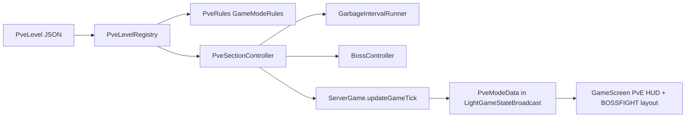

# PvE Mode Implementation

## Current state (verified)

- `GameHandler.init` creates **exactly one** `Board`; `slotBoard`/`slotSeat` are all-zero placeholders ([GameHandler.java](core/src/main/java/me/ethanchen/game/GameHandler.java) lines 47-70). Test seams `addBoardStateForTesting` / `setSlotBoardMappingForTesting` already exist.
- `ServerGame` is already board-indexed: `scorers[]`, `blocked[]`, `noobGravity[]` are sized by `game.getBoards().size()`, and `globalScore` is session-wide — exactly the semantics PvE needs for global SCORE criteria.
- `GameEndController` already tracks per-board resolve/win and finalizes when all boards resolve — matches "everyone passes if at least one board finishes".
- Client renders one board only: `GameDrawMode { NONE, SINGLE_BOARD }` in [GameScreen.java](lwjgl3/src/main/java/me/ethanchen/lwjgl3/menuscreens/GameScreen.java), centered via `BoardRenderer.centeredOriginX/Y`.
- `Board` has only `Board(Presets)` and `Board(NetBoardFull)` constructors; geometry comes from [BoardPreset.java](core/src/main/java/me/ethanchen/game/board/BoardPreset.java).
- Profile data persists as `extra_json` inside `PlayerProfile` (no SQL migration needed for a new field). LAN profiles never persist.
- No JSON game-data loader exists yet; libGDX `Json` is used everywhere else.



---

## Phase 1 — True multi-board support

Prerequisite for everything else; keeps existing modes on 1 board.

- Extend `GameModeRules` with a board-layout hook rather than the single `boardPreset(int)`:

```java
/** Board geometry for each board in the session, in board order. */
default Board.Presets[] boardLayout(int numPlayers) { return new Board.Presets[]{ boardPreset(numPlayers) }; }
/** Global slot -> board index. */
default int[] slotToBoard(int numPlayers) { return new int[numPlayers]; } // all zeros
```

- Rewrite `GameHandler.init` to loop over the layout, creating one `Board` + one `BoardState` each, then derive `slotSeat` as the per-board running index, and call `setBoardIndex`/`setSeatSlots` per board.
- `GameRoom.startGame` / `ServerGame.startGame` already size collaborators from `game.getBoards().size()`; verify `MeterController.reset(..., numBoards)` and `BlockedSpawnController` wiring hold for N boards.
- `StartGameBroadcast` already carries `boards[]`, `slotBoardIndex[]`, `slotSeatIndex[]` — populate them for real instead of zeros. Bump `NetworkRegister.PROTOCOL_VERSION`.
- Client: add `GameDrawMode.DUAL_BOARD`; add `BoardRenderer` helpers `originXForColumn(board, tileSize, column, totalColumns)` so N boards lay out side-by-side, and stop filtering particles/HUD to `primaryBoardIndex()` when more than one board is drawn (filter per-board instead).
- PvE slot split: 1-2 players => 1 board; 3 players => boards of 1 and 2; 4 players => two boards of 2.

## Phase 2 — PvE data model, JSON format, registry

New package `core/src/main/java/me/ethanchen/game/pve/`:

- `PveCriterionType` enum (`SCORE`, `TIME`, extensible like `ArtifactEffectType`), `PveCriterion { type, value }`.
- `PveSection`: `PveCriterion[][] pass` (outer OR, inner AND), `long timeoutMs`, `PveEnvironment env`, `PveBoardDisplay display` (`BOARD_DEFAULT`, `BOARD_BOSSFIGHT`).
- `PveEnvironment`: nullable/`Integer`-style override fields so unset means "inherit default" — `gravityMs`, `gravitySpeedFactor`, `bossId` (default -1), `GarbageInterval[] garbage` (default empty).
- `GarbageInterval { intervalMs, initialMs, GarbageStyle style, amount }`, `GarbageStyle { DEFAULT, DOUBLE_HOLE, CUSTOM }`.
- `PveLevelData`: `sections[]`, `difficultyRank`, plus per-player-count geometry (`width`, `height`, `spawns`, `initialTiles`, `blockedTiles`) for counts 1 and 2.
- Loader `PveLevelLoader.load(String path)` using `com.badlogic.gdx.utils.Json` on `Gdx.files.internal("pve/...")` (matches existing `AccountStore`/`SettingsManager` usage). Files live in `assets/pve/levels/`.
- Board geometry: add `BoardPreset.fromPve(PveBoardSpec)` producing width/height/`allowedTiles`/spawns/queues, plus a `Board(BoardPreset)` constructor and an `applyInitialTiles(...)` step called from `prepareBoard`.
- `PveLevelRegistry` (Part 5): `register(int id, String name, String[] difficultyJsonPaths, PveLootTable loot)`; static init block registering built-in levels; `byId(int)`, `count()`, `all()`.
- `PveLootTable` functional interface `Artifact roll(Random rng, long xp)`.

## Phase 3 — PvE gamemode + section engine (server)

- Add `GameMode.PVE` returning a new `PveRules` implementing the extended `GameModeRules` (board layout from the selected level's geometry, initial gravity from section 0, `prepareBoard` applying initial tiles). PvE uses the built-in scorer, so treat it like the score modes wherever `MULTIPLAYER_SCORE || CHARACTER_SCORE` is checked in `ServerGame`/`GameEndController`.
- Selected level/difficulty must reach the rules object: pass it through `ServerGame.startGame` into a `PveSessionState` held by `ServerGame` (avoid statics; rules is a singleton).
- New `core/.../server/PveSectionController`, ticked from `ServerGame.updateGameTick()` right after `game.update(deltaTime)`:
  - Tracks `sectionIndex`, `sectionElapsedMs`, `sectionStartGlobalScore`.
  - `sectionScore = globalScore - sectionStartGlobalScore` (spec: SCORE is per-section gain, global across boards).
  - Evaluates OR-of-AND criteria each tick; on pass, advances section and applies the new environment. At `timeoutMs`, re-evaluates once: pass advances, otherwise the whole session is lost.
  - Empty criteria array = boss section; advances only when `BossController` reports defeat.
  - Applies env on section entry: `game.setGravity(b, ms)` per board, reset garbage runners.
- `GarbageIntervalRunner` per board: accumulates `initialMs`, fires every `intervalMs`, calls a new `Board.spawnGarbageRows(int amount, GarbageStyle style, Random rng)` that pushes existing stack up and inserts `amount` identical rows (generalizing the existing `spawnGarbageLines`, which only fills the bottom rows).
- Loss/win: a PvE section fail resolves all boards as lost; completing the last section resolves all remaining running boards as won. Eliminated boards stay eliminated (already the `BlockedSpawnController` -> `beginBoardLoss` behavior) and are simply excluded from further play, while the session continues if any board still runs.
- Add `PveModeEndData` (sections cleared, time, final score, reuse the stat arrays) and wire into `GameEndController.finalizeSession` + `EndGameBroadcast`.

## Phase 4 — PvE networking and in-game HUD

- New `PveModeData` in `core/.../packets/s2c/gamemode/`: `sectionIndex`, `sectionElapsedMs`, `sectionTimeoutMs`, `sectionScore`, `displayMode`, `bossId`, `bossHp`, `bossMaxHp`, `bossPhase`, `bossPhaseElapsedMs`, `bossPhaseDurationMs`. Add field to `LightGameStateBroadcast`; populate in `ServerGame.populateModeData`; register in `NetworkRegister`.
- Client `GameScreen`: store `latestPveMode`; choose `GameDrawMode` from `displayMode` (`BOARD_DEFAULT` -> existing single/dual layout; `BOARD_BOSSFIGHT` -> new layout).
- Add `BoardHudRenderer.drawSectionTimerBox(...)` mirroring `drawTimerBox`, placed below the existing timer box in the left HUD column.

## Phase 5 — Level selection UI + unlock progression

- `PlayerProfile`: add `public int pveUnlockedLevels = 1;` — auto-persisted through `AccountExtra` -> `extra_json`, auto-synced via `ProfileSyncBroadcast`. `LanProfileFactory` can unlock all.
- `LobbySettings` + `LobbySettingsRequest` + `LobbySettingsBroadcast`: add `pveLevelId`, `pveDifficulty`. Server `GameRoom.handleLobbySettingsRequest` validates host-only (already does) **and** that the host has the level unlocked (`hostProfile.pveUnlockedLevels > levelId`).
- `LobbySettingsScreen`: add `GameMode.PVE` to `nextMode()`/`modeLabel()`. Fill the empty band (relative Y ~0.175-0.51) with a carousel: 5 thumbnails (center large, +/-1 and +/-2 smaller), clickable to jump, plus a difficulty cycle button shown only when the level has >1 difficulty. New `PveLevelAssets` cache mirroring `CharacterAssets`, with fallback `Color.fromHsv((137 * id) % 360, 1f, 1f)` filled rect (same pattern as `PieceTints.hsv`). Locked levels render dimmed and unclickable.
- Force single local player: in `GameRoom`, when `pendingGamemode == PVE`, drop each member's seats to 1 (extras become spectators via `reseat()`), and reject `LocalPlayerCountRequest > 1`. Client `LocalPlayerSidebar` should disable the control for PvE.
- Unlock on victory in `GameRoom.sendEndGame`: for PvE wins, for each seat with a non-empty `accountUuid`, if `profile.pveUnlockedLevels == levelId + 1` then increment and save (this alone enforces "no skipping"). Grant artifacts via the level's `PveLootTable` in a `grantPveVictoryArtifacts` variant of the existing `grantVictoryArtifacts`.

## Phase 6 — Bossfights

- `core/.../game/pve/boss/BossDef`: `id`, `maxHp`, `stunMsOnInterrupt`, `BossAttack[] pattern`.
- `BossAttack`: `idleMs`, `windupMs`, `attackMs`, `interruptScore`, and an effect (start with `ADD_GARBAGE(amount, style)`). Even instant effects keep a nonzero `attackMs` for animation feedback.
- `BossRegistry` mapping id -> `BossDef` (code-defined, per spec).
- `core/.../server/BossController`: phase machine `IDLE -> WINDUP -> ATTACK -> IDLE` (plus `STUNNED`), ticked by `PveSectionController`. Damage = score gained since the boss section started (score deltas feed HP, mirroring how `MeterController.onScoreEvent` consumes score). Score accrued during a windup counts toward `interruptScore`; reaching it cancels the attack and enters `STUNNED` for `stunMsOnInterrupt`, resuming at the next attack in the pattern. At 0 HP, report defeat so the section passes.
- Client bossfight layout in `GameScreen`: board on the left (custom `originX`, smaller `maxFraction`), boss portrait via `CharacterAssets.portraitFor(0)` on the right, other boards hidden. Ripple driven by `RippleCircleRenderer` (already shader-backed, used by `PlayerRipples`): idle = steady radius, windup = smooth grow + color shift over `bossPhaseDurationMs`, attack = fast shrink + color snap. Boss HP bar next to the portrait, reusing the `CharacterMeterRenderer` drawing pattern.

## Phase 7 — First level and loot table

- `assets/pve/levels/level_0_normal.json` per Part 4: 10s grace section; `[[{SCORE,4000}],[{SCORE,2500},{TIME,60000}]]` with `timeoutMs: 60000`; 30s section with one `GarbageInterval { intervalMs: 4000, amount: 1, style: DEFAULT }`; boss section with empty criteria and `bossId: 0`.
- Boss 0: 10,000 HP; pattern = idle 5000ms, then windup 2000ms / attack 1000ms adding 4 garbage lines, `interruptScore: 800`. Placeholder character texture.
- Register in `PveLevelRegistry` with one difficulty and a loot table rolling T-piece artifacts at level 2 or 3 via `ArtifactRoller.roll(Piece.T, level, baseQuality, rng)`.
- Add `assets/pve/` to the packaged asset list if `assets.txt` is used as a manifest.

## Verification

- Unit tests for criteria evaluation (OR/AND, timeout re-check), section advance, garbage interval timing, and boss phase/interrupt transitions.
- Multi-board regression: existing score/puzzle modes must still create 1 board and render identically.
- Manual: run headless server + two clients, play level 0 through the boss at 1, 2, 3, and 4 players; confirm unlock increments only when the level was already unlocked.
- Protocol version bumped once, at the end, covering all packet changes.